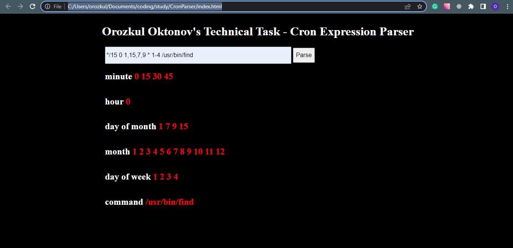

# Orozkul Oktonov's Technical Task - Cron Expression Parser

A program that parses Cron Expressions

## Note, in order to run this project, you should unzip the whole folder. script.js and index.html files should be in the same folder.

## Technologies

- JavaScript
- HTML

## How to run a program

#### Note, in order to run this project, you should unzip the whole folder.
#### Note, script.js and index.html files should be in the same folder.

Open the index.html file located in CronParser folder with your web browser.
You should see a screen similar to this:

Paste your text in the text-field and click the Parse-button

## Test cases
- '6' - single number. In this case, I just return this number. (output: 6)
- '4, 8, 1, 7' - comma separated numbers. In this case, I return distinct sorted array of this number. (output: 1 4 7 8)
- '*' - any. In this case, I return all possible values of field. (output for days of week: 1 2 3 4 5 6 7)
- '*/3' - all elements with step of 3. In this case, I return each value with step 3. (output for days of week: 1 4 7)
- '3-9/2' - all elements with step of 2 in a range of 3-9. In this case, I return each value with step 2 between 3 and 9. (output: 3 5 7 9)
- '2-5' - range. In this case, I return numbers in a range of 2 and 5. (output: 2 3 4 5)